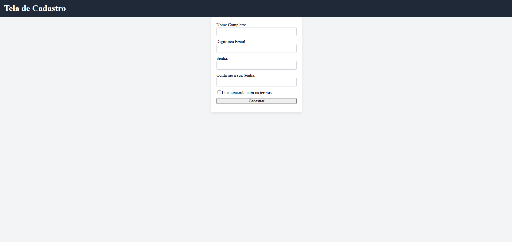
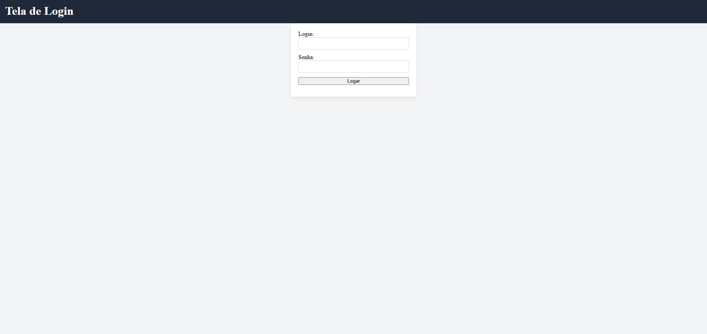

# 📄 Formulário de Cadastro em HTML

Este projeto consiste no desenvolvimento de uma **tela de cadastro estruturada em HTML**, com foco em boas práticas, organização e uso de elementos semânticos.

O objetivo principal foi **reforçar fundamentos essenciais do desenvolvimento front-end**, criando uma base sólida antes de avançar para CSS mais avançado e JavaScript.

---

# 📷 Preview do Projeto

---

---

# 🚀 Sobre o Projeto

A aplicação apresenta uma **interface de formulário de cadastro** utilizando HTML5 e aplicando boas práticas como:

- Estrutura HTML organizada
- Uso correto da tag `<form>`
- Associação de **labels com inputs**
- Tipos de input apropriados (`text`, `email`, `password`, `checkbox`)
- Validação básica com `required`
- Organização do formulário em seções
- Separação de responsabilidades (**HTML + CSS externo**)

---

# 🎯 Objetivo Técnico

Este projeto foi desenvolvido para:

- Consolidar fundamentos de **HTML**
- Aplicar **boas práticas estruturais**
- Desenvolver disciplina na **organização do código**
- Criar base sólida antes de avançar para **CSS e JavaScript**

---

# 📚 Aprendizados

Durante o desenvolvimento deste projeto pude praticar:

- Estruturação correta de formulários em HTML
- Associação de **labels com inputs**
- Uso de validações básicas com `required`
- Organização de código para melhor manutenção
- Separação entre estrutura (**HTML**) e estilo (**CSS**)

---

# 🛠️ Tecnologias Utilizadas

- **HTML5**
- **CSS3** (arquivo externo preparado para estilização futura)

---

# 📈 Melhorias Futuras

Algumas melhorias planejadas para evolução do projeto:

- Aplicar **estilização completa com CSS**
- Melhorar a **responsividade para dispositivos móveis**
- Implementar **validação com JavaScript**
- Evoluir futuramente para **integração com back-end**

---

# 👨‍💻 Autor

**Lucca Ramos**

🎓 Estudante de **Análise e Desenvolvimento de Sistemas**  
💻 Estagiário de **Suporte Técnico**

🔗 LinkedIn  
https://www.linkedin.com/in/lucca-ramos/

🔗 GitHub  
https://github.com/Lucca-Gomes

---

💡 Este projeto faz parte do meu processo de aprendizado e evolução contínua na área de tecnologia e desenvolvimento web.